# Database schema

A simplified view of the current schema — see `db/migrations/*.sql` for the authoritative,
migration-by-migration source of truth (including the exact `CONSTRAINT`/`INDEX` names and the
SQLite-specific quirks called out in `0001_init.sql`'s header comment). This doc collapses every
migration's `ALTER TABLE`/rebuild steps into each table's current shape and skips the
`schema_migrations` bookkeeping table, but lists every column of every live table.

**Keep this file in sync**: whenever a migration in `db/migrations/` adds, drops, or changes a
table or column, update both the DDL and the diagram below in the same change.

## Simplified DDL

```sql
CREATE TABLE User (
    id                TEXT PRIMARY KEY,
    name              TEXT NOT NULL,
    email             TEXT NOT NULL UNIQUE,
    avatarUrl         TEXT,
    provider          TEXT,
    passwordHash      TEXT,
    emailVerifiedAt   DATETIME,
    role              TEXT NOT NULL DEFAULT 'pending',
    createdAt         DATETIME NOT NULL
);

CREATE TABLE VerificationToken (
    id          TEXT PRIMARY KEY,
    userId      TEXT NOT NULL REFERENCES User(id),
    tokenHash   TEXT NOT NULL UNIQUE,
    type        TEXT NOT NULL,          -- 'email_verify' | 'password_reset'
    expiresAt   DATETIME NOT NULL,
    usedAt      DATETIME,
    createdAt   DATETIME NOT NULL
);

-- Structural reference data every <select> in the app reads from (client types, asset types,
-- condition states, activity types, project stages, priorities, treatment methods,
-- annotation types). One table, discriminated by `type`.
CREATE TABLE Classifier (
    id              TEXT PRIMARY KEY,
    type            TEXT NOT NULL,      -- e.g. 'asset_type', 'condition_state', 'project_stage'...
    code            TEXT NOT NULL,      -- UNIQUE(type, code)
    sequence        INTEGER NOT NULL DEFAULT 0,
    title           TEXT NOT NULL,
    titleEt         TEXT,               -- Estonian label, NULL falls back to `title`
    description     TEXT,
    descriptionEt   TEXT,               -- Estonian label, NULL falls back to `description`
    data            TEXT,               -- JSON, shape depends on `type` (e.g. hatch color/pattern)
    isActive        INTEGER NOT NULL DEFAULT 1,
    createdAt       DATETIME NOT NULL,
    updatedAt       DATETIME NOT NULL
);

CREATE TABLE Client (
    id                       TEXT PRIMARY KEY,
    type                     TEXT NOT NULL DEFAULT 'individual',   -- Classifier code, type = 'client_type'
    name                     TEXT NOT NULL,
    email                    TEXT,
    phone                    TEXT,
    address                  TEXT,
    city                     TEXT,
    postalCode               TEXT,
    country                  TEXT,
    notes                    TEXT,
    organizationName         TEXT,
    contactPerson            TEXT,
    taxId                    TEXT,
    preferredContactMethod   TEXT,           -- Classifier code, type = 'contact_method'
    referralSource           TEXT,
    createdAt                DATETIME NOT NULL,
    updatedAt                DATETIME NOT NULL
);

-- The object being conserved. Registering one leads straight into its first Project.
CREATE TABLE Asset (
    id                 TEXT PRIMARY KEY,
    clientId           TEXT NOT NULL REFERENCES Client(id),
    referenceCode      TEXT NOT NULL UNIQUE,
    assetTypeId        TEXT NOT NULL REFERENCES Classifier(id),      -- type = 'asset_type'
    title              TEXT,
    artist             TEXT,
    creationPeriod     TEXT,
    dimensions         TEXT,
    description        TEXT,
    medium             TEXT,
    signatureMarks     TEXT,
    weight             TEXT,
    provenance         TEXT,
    acquisitionDate    DATETIME,
    estimatedValue     REAL,
    isInsured          INTEGER,
    locationInStudio   TEXT,
    currentStateId     TEXT UNIQUE REFERENCES Assessment(id),        -- latest condition snapshot
    createdAt          DATETIME NOT NULL,
    updatedAt          DATETIME NOT NULL
);

-- Project is the mandatory organizing unit: Assessments, Treatments, Reports and Media are all
-- recorded under a Project, and stay filterable by Asset too.
CREATE TABLE Project (
    id                 TEXT PRIMARY KEY,
    assetId            TEXT NOT NULL REFERENCES Asset(id),
    title              TEXT NOT NULL,
    stage              TEXT NOT NULL DEFAULT 'inquiry',    -- Classifier code, type = 'project_stage'
    priority           TEXT NOT NULL DEFAULT 'standard',   -- Classifier code, type = 'priority'
    targetReviewDate   DATETIME,
    assignedToUserId   TEXT REFERENCES User(id),
    startedAt          DATETIME,
    completedAt        DATETIME,
    createdAt          DATETIME NOT NULL,
    updatedAt          DATETIME NOT NULL,
    deletedAt          DATETIME             -- soft delete ("unlink" from Asset detail view)
);

-- Condition-status record. Renamed from the earlier AssetState concept.
CREATE TABLE Assessment (
    id            TEXT PRIMARY KEY,
    assetId       TEXT NOT NULL REFERENCES Asset(id),
    projectId     TEXT NOT NULL REFERENCES Project(id),
    condition     TEXT NOT NULL,           -- Classifier code, type = 'condition_state'
    description   TEXT NOT NULL,
    recordedAt    DATETIME NOT NULL,
    updatedAt     DATETIME NOT NULL,
    deletedAt     DATETIME
);

-- Conservation work performed.
CREATE TABLE Treatment (
    id                  TEXT PRIMARY KEY,
    assetId             TEXT NOT NULL REFERENCES Asset(id),
    projectId           TEXT NOT NULL REFERENCES Project(id),
    method              TEXT NOT NULL,     -- Classifier code, type = 'treatment_method'
    title               TEXT NOT NULL,
    notes               TEXT NOT NULL,
    performedByUserId   TEXT REFERENCES User(id),
    performedAt         DATETIME NOT NULL,
    createdAt           DATETIME NOT NULL,
    updatedAt           DATETIME NOT NULL,
    deletedAt           DATETIME
);

-- Structured, exportable report. `content` is a legacy freeform TipTap JSON doc kept for old
-- rows only. conditionFindings/treatmentPerformed/materialsUsed/showCondition/showTreatment/
-- showMaterials are legacy too - kept so old report data isn't lost, but no longer shown or
-- edited in the UI; `description` (general notes/misc) replaced them as of 0019. `deletedAt`
-- doubles as the "Removed" tag: a removed report stays in the gridview search, just hidden by
-- default unless the Removed filter chip is used.
CREATE TABLE Report (
    id                    TEXT PRIMARY KEY,
    projectId             TEXT NOT NULL REFERENCES Project(id),
    assetId               TEXT NOT NULL REFERENCES Asset(id),
    title                 TEXT NOT NULL,
    content               TEXT NOT NULL,     -- legacy, unused by new reports
    status                TEXT NOT NULL DEFAULT 'draft',
    authorId              TEXT REFERENCES User(id),
    description           TEXT,              -- general notes/misc (0019)
    summary               TEXT,
    conditionFindings     TEXT,              -- legacy, unused by new reports
    treatmentPerformed    TEXT,              -- legacy, unused by new reports
    materialsUsed         TEXT,              -- legacy, unused by new reports
    recommendations       TEXT,
    coverMediaId          TEXT REFERENCES Media(id),
    layoutStyle           TEXT NOT NULL DEFAULT 'standard',
    galleryColumns        INTEGER NOT NULL DEFAULT 2,   -- 1 or 2 (0019)
    showCover             INTEGER NOT NULL DEFAULT 1,   -- section toggle
    showDescription       INTEGER NOT NULL DEFAULT 1,   -- section toggle (0019)
    showSummary           INTEGER NOT NULL DEFAULT 1,   -- section toggle
    showCondition         INTEGER NOT NULL DEFAULT 1,   -- section toggle, legacy
    showTreatment         INTEGER NOT NULL DEFAULT 1,   -- section toggle, legacy
    showMaterials         INTEGER NOT NULL DEFAULT 1,   -- section toggle, legacy
    showRecommendations   INTEGER NOT NULL DEFAULT 1,   -- section toggle
    createdAt             DATETIME NOT NULL,
    updatedAt             DATETIME NOT NULL,
    deletedAt             DATETIME
);

-- Per-report image gallery customization (drag-drop order, per-image "stretch to column width")
-- for a MediaReference the report's gallery displays. Lives in its own table rather than as
-- columns on MediaReference because the same reference can appear in several reports' galleries
-- at once. A row only exists once a conservator has customized that item for that report; absent
-- a row, the gallery falls back to default timestamp order and non-stretched display.
CREATE TABLE ReportGalleryItem (
    id                 TEXT PRIMARY KEY,
    reportId           TEXT NOT NULL REFERENCES Report(id),
    mediaReferenceId   TEXT NOT NULL REFERENCES MediaReference(id),   -- UNIQUE(reportId, mediaReferenceId)
    sortOrder          INTEGER NOT NULL DEFAULT 0,
    stretch            INTEGER NOT NULL DEFAULT 0,
    createdAt          DATETIME NOT NULL
);

-- Legacy "Activity Notebook" — retired (Treatment is now the sole way to record conservation
-- work), but old rows are still read back for historical project export. No new rows are written.
CREATE TABLE Activity (
    id                TEXT PRIMARY KEY,
    projectId         TEXT NOT NULL REFERENCES Project(id),
    activityTypeId    TEXT NOT NULL REFERENCES Classifier(id),   -- type = 'activity_type'
    userId            TEXT NOT NULL REFERENCES User(id),
    description       TEXT NOT NULL,
    startedAt         DATETIME NOT NULL,
    endedAt           DATETIME,
    durationMinutes   INTEGER,
    materialsUsed     TEXT,
    createdAt         DATETIME NOT NULL
);

CREATE TABLE Media (
    id                 TEXT PRIMARY KEY,
    storageKey         TEXT NOT NULL,
    kind               TEXT NOT NULL,       -- 'image' | 'video' | ...
    mimeType           TEXT NOT NULL,
    sizeBytes          INTEGER NOT NULL,
    width              INTEGER,
    height             INTEGER,
    durationSeconds    INTEGER,
    checksum           TEXT NOT NULL,
    uploadedByUserId   TEXT NOT NULL REFERENCES User(id),
    editedFromId       TEXT REFERENCES Media(id),   -- self-FK: derivative of another Media row
    description        TEXT,
    createdAt          DATETIME NOT NULL
);

-- Polymorphic attach point: one Media item can be attached to any of several record types.
-- referencingType/referencingId are NOT a real foreign key (SQLite can't target multiple
-- tables) — enforcement is app-level only.
CREATE TABLE MediaReference (
    id                TEXT PRIMARY KEY,
    mediaId           TEXT NOT NULL REFERENCES Media(id),
    referencingType   TEXT NOT NULL,   -- 'Asset' | 'Project' | 'Treatment' | 'Report' | 'Assessment' | 'Activity'
    referencingId     TEXT NOT NULL,   -- id in whichever table referencingType names
    role              TEXT,
    sortOrder         INTEGER NOT NULL DEFAULT 0,
    caption           TEXT,
    createdAt         DATETIME NOT NULL
);

-- The media "pattern layer": drawn regions over a Media item, each tagged with a hatch-pattern
-- annotation type. Coordinates are percentage-based (0-100) so a region survives any image
-- resize.
CREATE TABLE MediaAnnotationRegion (
    id                 TEXT PRIMARY KEY,
    mediaId            TEXT NOT NULL REFERENCES Media(id),
    annotationTypeId   TEXT NOT NULL REFERENCES Classifier(id),  -- type = 'annotation_type'
    xPct               REAL NOT NULL,
    yPct               REAL NOT NULL,
    widthPct           REAL NOT NULL,
    heightPct          REAL NOT NULL,
    shape              TEXT NOT NULL DEFAULT 'rect',  -- 'rect' | freehand
    pathData           TEXT,                          -- SVG path, when shape != 'rect'
    createdAt          DATETIME NOT NULL
);

-- Generic admin-configurable key/value store (dashboard list caps, reportable-field toggles).
CREATE TABLE AppSetting (
    id          TEXT PRIMARY KEY,
    key         TEXT NOT NULL UNIQUE,
    value       TEXT NOT NULL,
    updatedAt   DATETIME NOT NULL
);
```

### Removed from the schema along the way

Dropped by later migrations, mentioned here only for history — not in the current DB:
`AssetMaterial`, `Tag`, `TagAssignment` (free-form tagging, `0005`); `Quote`, `"Order"`, `Invoice`
(commerce, out of scope for the design artifact, `0004`); `AssetState` (renamed/replaced by
`Assessment`, `0015`).

## Schema diagram

Every entity below lists every column from the DDL above (`PK`/`FK`/`UK` markers shown where the
DDL declares them; a comment marks columns that are a Classifier `code` by convention rather than
an enforced foreign key).

```mermaid
erDiagram
    User {
        string id PK
        string name
        string email UK
        string avatarUrl
        string provider
        string passwordHash
        datetime emailVerifiedAt
        string role
        datetime createdAt
    }
    VerificationToken {
        string id PK
        string userId FK
        string tokenHash UK
        string type
        datetime expiresAt
        datetime usedAt
        datetime createdAt
    }
    Classifier {
        string id PK
        string type
        string code
        int sequence
        string title
        string titleEt
        string description
        string descriptionEt
        string data "JSON"
        int isActive
        datetime createdAt
        datetime updatedAt
    }
    Client {
        string id PK
        string type "code, type='client_type'"
        string name
        string email
        string phone
        string address
        string city
        string postalCode
        string country
        string notes
        string organizationName
        string contactPerson
        string taxId
        string preferredContactMethod "code, type='contact_method'"
        string referralSource
        datetime createdAt
        datetime updatedAt
    }
    Asset {
        string id PK
        string clientId FK
        string referenceCode UK
        string assetTypeId FK
        string title
        string artist
        string creationPeriod
        string dimensions
        string description
        string medium
        string signatureMarks
        string weight
        string provenance
        datetime acquisitionDate
        real estimatedValue
        int isInsured
        string locationInStudio
        string currentStateId FK,UK
        datetime createdAt
        datetime updatedAt
    }
    Project {
        string id PK
        string assetId FK
        string title
        string stage "code, type='project_stage'"
        string priority "code, type='priority'"
        datetime targetReviewDate
        string assignedToUserId FK
        datetime startedAt
        datetime completedAt
        datetime createdAt
        datetime updatedAt
        datetime deletedAt "soft delete"
    }
    Assessment {
        string id PK
        string assetId FK
        string projectId FK
        string condition "code, type='condition_state'"
        string description
        datetime recordedAt
        datetime updatedAt
        datetime deletedAt "soft delete"
    }
    Treatment {
        string id PK
        string assetId FK
        string projectId FK
        string method "code, type='treatment_method'"
        string title
        string notes
        string performedByUserId FK
        datetime performedAt
        datetime createdAt
        datetime updatedAt
        datetime deletedAt "soft delete"
    }
    Report {
        string id PK
        string projectId FK
        string assetId FK
        string title
        string content "legacy TipTap JSON"
        string status
        string authorId FK
        string description "general notes/misc"
        string summary
        string conditionFindings "legacy"
        string treatmentPerformed "legacy"
        string materialsUsed "legacy"
        string recommendations
        string coverMediaId FK
        string layoutStyle
        int galleryColumns "1 or 2"
        int showCover
        int showDescription
        int showSummary
        int showCondition "legacy"
        int showTreatment "legacy"
        int showMaterials "legacy"
        int showRecommendations
        datetime createdAt
        datetime updatedAt
        datetime deletedAt "soft delete / removed tag"
    }
    ReportGalleryItem {
        string id PK
        string reportId FK
        string mediaReferenceId FK "UK with reportId"
        int sortOrder
        int stretch
        datetime createdAt
    }
    Activity {
        string id PK
        string projectId FK
        string activityTypeId FK
        string userId FK
        string description
        datetime startedAt
        datetime endedAt
        int durationMinutes
        string materialsUsed
        datetime createdAt
    }
    Media {
        string id PK
        string storageKey
        string kind
        string mimeType
        int sizeBytes
        int width
        int height
        int durationSeconds
        string checksum
        string uploadedByUserId FK
        string editedFromId FK
        string description
        datetime createdAt
    }
    MediaReference {
        string id PK
        string mediaId FK
        string referencingType "polymorphic, not FK-enforced"
        string referencingId "polymorphic, not FK-enforced"
        string role
        int sortOrder
        string caption
        datetime createdAt
    }
    MediaAnnotationRegion {
        string id PK
        string mediaId FK
        string annotationTypeId FK
        real xPct
        real yPct
        real widthPct
        real heightPct
        string shape
        string pathData
        datetime createdAt
    }
    AppSetting {
        string id PK
        string key UK
        string value
        datetime updatedAt
    }

    Client       ||--o{ Asset             : owns
    Asset        ||--o{ Project           : "organized as"
    Asset        ||--o{ Assessment        : "assessed in"
    Asset        ||--o{ Treatment         : "treated in"
    Asset        ||--o{ Report            : "reported in"
    Asset        |o--o| Assessment        : "currentState (latest)"
    Project      ||--o{ Assessment        : records
    Project      ||--o{ Treatment         : records
    Project      ||--o{ Report            : records
    Project      ||--o{ Activity          : "legacy log"
    Project      }o--o| User              : "assigned to"
    Treatment    }o--o| User              : "performed by"
    Report       }o--o| User              : "authored by"
    Report       }o--o| Media             : "cover image"
    Report       ||--o{ ReportGalleryItem : "gallery customization"
    MediaReference ||--o{ ReportGalleryItem : "gallery customization"
    Activity     }o--o| User              : "logged by"
    Media        ||--o{ MediaReference    : "attached via"
    Media        ||--o{ MediaAnnotationRegion : "annotated by"
    Media        |o--o| Media             : "edited from"
    User         ||--o{ VerificationToken : has
    User         ||--o{ Media             : uploads
    Classifier   ||--o{ Asset             : "asset type"
    Classifier   ||--o{ Client            : "client type / contact method"
    Classifier   ||--o{ Project           : "stage / priority (by code, not FK)"
    Classifier   ||--o{ Assessment        : "condition (by code, not FK)"
    Classifier   ||--o{ Treatment         : "method (by code, not FK)"
    Classifier   ||--o{ Activity          : "activity type"
    Classifier   ||--o{ MediaAnnotationRegion : "annotation type"
```



`MediaReference.referencingId` can point at `Asset`, `Project`, `Treatment`, `Report`,
`Assessment`, or `Activity` depending on `referencingType` — not drawn above since it isn't a
real foreign key.
